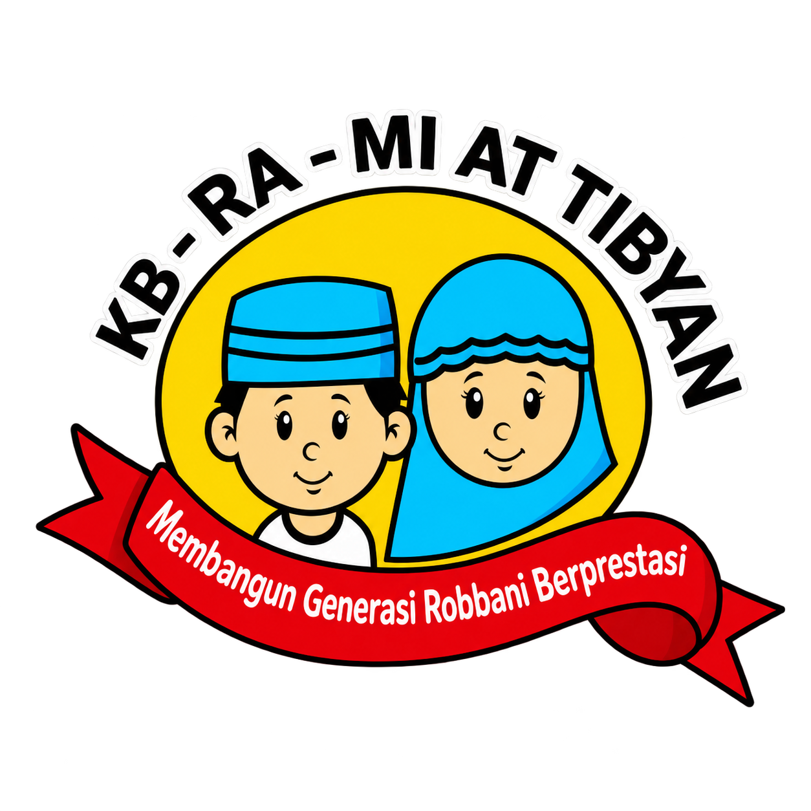

<!DOCTYPE html>
<html lang="id">
<head>
<meta charset="UTF-8">
<meta name="viewport" content="width=device-width, initial-scale=1">
<title>Absensi Online KB RA At Tibyan</title>
<link rel="icon" href="logo.png">

</head>
<body>

  <!-- PILIHAN MASUK -->
  

    
    

      
Absensi Online

      
KB RA At Tibyan

      

    

    
Masuk sebagai

    <button onclick="pilih('vLogin')">👤 Guru</button>
    <button class="purple" onclick="pilih('vKLogin')">🏫 Kepala Sekolah</button>
    <button class="gray" onclick="bukaWali()">👪 Wali Murid</button>
    

  

  <!-- LOGIN GURU -->
  

    <h3 style="text-align:center;margin-bottom:14px">Login Guru</h3>
    <input type="text" id="user" placeholder="Username" autocomplete="username">
    <input type="password" id="pass" placeholder="Password" autocomplete="current-password">
    <button id="btnLogin" onclick="doLogin()">LOGIN</button>
    

    <button class="gray" onclick="pilih('vPilih')">Kembali</button>
  

  <!-- LOGIN KEPALA SEKOLAH -->
  

    <h3 style="text-align:center;margin-bottom:14px">Login Kepala Sekolah</h3>
    <input type="text" id="kUser" placeholder="Username" autocomplete="username">
    <input type="password" id="kPass" placeholder="Password" autocomplete="current-password">
    <button class="purple" id="btnK" onclick="loginKepsek()">LOGIN</button>
    

    <button class="gray" onclick="pilih('vPilih')">Kembali</button>
  

  <!-- LOGIN WALI MURID -->
  

    <h3 style="text-align:center">Wali Murid</h3>
    
Masukkan nama anak dan Kode Wali dari sekolah.

    <input type="text" id="wNama" placeholder="Nama anak (sesuai data sekolah)">
    <input type="text" id="wKode" placeholder="Kode Wali" autocapitalize="characters" autocomplete="off">
    <button class="gray" id="btnWali" onclick="loginWali()">LIHAT ABSENSI</button>
    

    <button onclick="pilih('vPilih')">Kembali</button>
  

  <!-- REKAP UNTUK WALI MURID -->
  

    <h3 id="wJudul">Absensi</h3>
    

    <input type="month" id="wBulan">
    <button onclick="muatRekapWali()">Tampilkan</button>
    

    

    

    <button class="red" onclick="keluarWali()">Keluar</button>
  

  <!-- DASHBOARD KEPALA SEKOLAH -->
  

    

      <h2>Dashboard Kepala Sekolah</h2>
      
Selamat datang, <b id="kNama"></b>

    

    

      <h3>Ringkasan Absensi</h3>
      <input type="date" id="kTanggal">
      <button class="purple" onclick="muatRingkasan()">Tampilkan</button>
      <button onclick="bukaKRekap()">📊 Rekap Siswa</button>
      

      

      

    

    <button class="red" onclick="logout()">🚪 Keluar</button>
  

  <!-- REKAP SISWA (KEPALA SEKOLAH) -->
  

    <h3>📊 Rekap Siswa</h3>
    <select id="krKelas" class="full" onchange="isiSiswaK()"></select>
    <select id="krSiswa" class="full"></select>
    <input type="month" id="krBulan">
    <button class="purple" onclick="muatKRekap()">Tampilkan</button>
    

    

    

    <button class="gray" onclick="show('vKepsek')">Kembali</button>
  

  <!-- KAMERA (daftar wajah murid / scan absen) -->
  

    <h3 id="camTitle"></h3>
    

    <video id="video" playsinline muted class="hidden"></video>
    
    <input type="file" id="fileCam" accept="image/*" capture="user" class="hidden">
    <button id="btnCam" onclick="startCam()">📷 Aktifkan Kamera</button>
    <button id="btnSnap" class="green hidden" onclick="snap()">✅ Ambil Sampel Wajah</button>
    <button id="btnFile" class="gray" onclick="document.getElementById('fileCam').click()">Pakai aplikasi kamera HP</button>
    <button class="red" onclick="closeCam()">Selesai</button>
    

    

  

  <!-- REKAP SISWA (GURU) -->
  

    <h3>📊 Rekap Siswa</h3>
    <select id="rkSiswa" class="full"></select>
    <input type="month" id="rkBulan">
    <button onclick="muatRekap()">Tampilkan</button>
    

    

    

    <button class="gray" onclick="show('vDash')">Kembali</button>
  

  <!-- DASHBOARD GURU -->
  

    

      <h2>Dashboard Guru</h2>
      
Selamat datang, <b id="dNama"></b>

      
Kelas: <b id="dKelas"></b> &nbsp;|&nbsp; 

    

    

      <h3>Absensi Siswa</h3>
      <button class="green" onclick="mulaiScan()">📸 Scan Wajah Murid</button>
      <button onclick="bukaRekap()">📊 Rekap Siswa</button>
      

        <button class="gray" onclick="setSemua('Hadir')">Semua Hadir</button>
        <button class="gray" onclick="muatSiswa()">Muat Ulang</button>
      

      
Memuat...

      <button onclick="simpanManual()">💾 Simpan Manual</button>
      

      <button class="gray" id="btnUlang" style="display:none" onclick="bicara(S.lastUcapan)">🔊 Ulangi Suara</button>
    

    <button class="red" onclick="logout()">🚪 Keluar</button>
  

<script>
// ===== URL WEB APP APPS SCRIPT (berakhiran /exec) =====
var API_URL = "https://script.google.com/macros/s/AKfycbzyknrk3xLIRahq-A4TqlqCFW-y6fd_8VjXQBIPYcnG1jvHIWgVLNX_rCheCd88hwGR/exec";
// ======================================================

var MODEL_URL = "https://cdn.jsdelivr.net/npm/@vladmandic/face-api@1.7.12/model/";
var THRESHOLD = 0.5;   // makin kecil makin ketat (0.4 - 0.6)
var MARGIN = 0.03;     // selisih minimal dengan murid terdekat kedua
var S = { token:"", nama:"", kelas:"", mode:"", target:"", siswa:[], samples:[],
          selesai:{}, hitung:{}, scanning:false, lastUcapan:"" };
var K = { token:"", nama:"", kelas:[] };
var W = { token:"", nama:"", kelas:"" };
var modelsReady = false, stream = null;
var $ = function(id){ return document.getElementById(id); };
var wait = function(ms){ return new Promise(function(r){ setTimeout(r, ms); }); };

var VIEWS = ["vPilih","vLogin","vKLogin","vWali","vWaliHasil","vKepsek","vKRekap","vCam","vDash","vRekap"];
function show(id){
  VIEWS.forEach(function(v){ $(v).classList.add("hidden"); });
  $(id).classList.remove("hidden");
}
function say(el, text, cls){ el.className = "msg " + (cls||""); el.textContent = text; }
function pilih(id){
  ["loginMsg","kLoginMsg","wMsg"].forEach(function(m){ say($(m),"",""); });
  show(id);
}
function apiSiap(el){
  if(API_URL.indexOf("https://script.google.com/") !== 0){ say(el,"API_URL belum diisi di index.html","err"); return false; }
  return true;
}

// ==========================================
// KOMUNIKASI KE APPS SCRIPT
// (text/plain supaya tidak kena pemeriksaan CORS preflight)
// ==========================================
function api(action, data){
  var body = Object.assign({ action: action }, data || {});
  return fetch(API_URL, {
    method: "POST",
    headers: { "Content-Type": "text/plain;charset=utf-8" },
    body: JSON.stringify(body)
  }).then(function(r){ return r.json(); });
}
function galat(e){
  return "Gagal terhubung ke server. Cek internet / URL API. (" + (e && e.message ? e.message : e) + ")";
}
function sesiHabis(r){ return r && String(r.message).indexOf("Sesi habis") >= 0; }

// cek apakah API_URL terhubung ke script yang benar (tampil di layar pilihan masuk)
function cekServer(){
  var el = $("srvStatus");
  if(API_URL.indexOf("https://script.google.com/") !== 0){
    el.textContent = "API_URL belum diisi."; el.className = "msg err"; return;
  }
  el.textContent = "Memeriksa server..."; el.className = "msg info";
  fetch(API_URL).then(function(r){ return r.text(); }).then(function(t){
    if(t.indexOf("At Tibyan") >= 0){
      el.textContent = "Server tersambung"; el.className = "msg ok";
    } else if(t.indexOf("Attibyan") >= 0){
      el.textContent = "Server LAMA terdeteksi. Ganti API_URL dengan URL deployment script Absensi Attibyan.";
      el.className = "msg err";
    } else {
      el.textContent = "Server membalas, tapi bukan API absensi. Periksa API_URL.";
      el.className = "msg err";
    }
  }).catch(function(){
    el.textContent = "Server tidak terjangkau. Periksa internet atau pengaturan akses (Anyone).";
    el.className = "msg err";
  });
}

// ==========================================
// SUARA
// ==========================================
if("speechSynthesis" in window){
  speechSynthesis.onvoiceschanged = function(){ speechSynthesis.getVoices(); };
}
var audioCtx = null;

// harus dipanggil dari tap pengguna agar bunyi diizinkan HP
function initAudio(){
  try{
    var AC = window.AudioContext || window.webkitAudioContext;
    if(!AC) return;
    if(!audioCtx) audioCtx = new AC();
    if(audioCtx.state === "suspended") audioCtx.resume();
  }catch(e){}
}

// bunyi "tit-tit" cadangan (dipakai kalau bunyi.mp3 gagal diputar)
function titSintesis(){
  try{
    if(!audioCtx) return;
    if(audioCtx.state === "suspended") audioCtx.resume();

    var t = audioCtx.currentTime;

    var master = audioCtx.createGain();
    master.gain.value = 2.5;

    var comp = audioCtx.createDynamicsCompressor();
    comp.threshold.value = -30;
    comp.knee.value = 0;
    comp.ratio.value = 20;
    comp.attack.value = 0.001;
    comp.release.value = 0.05;

    master.connect(comp);
    comp.connect(audioCtx.destination);

    [[2000, 0], [2600, 0.19]].forEach(function(n){
      var f = n[0], mulai = t + n[1];
      ["square", "sawtooth"].forEach(function(jenis){
        var o = audioCtx.createOscillator();
        var g = audioCtx.createGain();
        o.type = jenis;
        o.frequency.value = f;
        g.gain.setValueAtTime(0.0001, mulai);
        g.gain.exponentialRampToValueAtTime(1.0, mulai + 0.005);
        g.gain.setValueAtTime(1.0, mulai + 0.12);
        g.gain.exponentialRampToValueAtTime(0.0001, mulai + 0.16);
        o.connect(g); g.connect(master);
        o.start(mulai); o.stop(mulai + 0.17);
      });
    });
  }catch(e){}
}

// bunyi dari file mp3 (bunyi.mp3 di folder yang sama dengan index.html)
var audioTit = new Audio("bunyi.mp3");
audioTit.preload = "auto";
audioTit.volume = 1.0;
var JEDA_SUARA = 1000;   // jeda (milidetik) antara bunyi tit dan ucapan nama

function tit(){
  try{
    audioTit.currentTime = 0;
    var p = audioTit.play();
    if(p && p.catch) p.catch(function(){ titSintesis(); });
  }catch(e){ titSintesis(); }
}
function unlockSuara(){
  initAudio();
  try{
    audioTit.muted = true;
    var p = audioTit.play();
    if(p && p.then){
      p.then(function(){ audioTit.pause(); audioTit.currentTime = 0; audioTit.muted = false; })
       .catch(function(){ audioTit.muted = false; });
    }
  }catch(e){}
  if(!("speechSynthesis" in window)) return;
  var u = new SpeechSynthesisUtterance(" ");
  u.volume = 0;
  speechSynthesis.speak(u);
}
function buatUtter(teks){
  var u = new SpeechSynthesisUtterance(teks);
  u.lang = "id-ID";
  u.rate = 0.9;
  u.pitch = 1.1;
  u.volume = 1;

  var daftar = speechSynthesis.getVoices().filter(function(x){
    return x.lang && x.lang.toLowerCase().replace("_","-").indexOf("id") === 0;
  });
  daftar.sort(function(a,b){ return (a.localService?1:0) - (b.localService?1:0); });
  if(daftar[0]) u.voice = daftar[0];
  return u;
}
function bicara(teks){
  if(!teks || !("speechSynthesis" in window)) return;
  speechSynthesis.cancel();
  speechSynthesis.speak(buatUtter(teks));
}
function bicaraAntri(teks){
  if(!teks || !("speechSynthesis" in window)) return;
  speechSynthesis.speak(buatUtter(teks));
}
function susunUcapan(r){
  var h = r.hasil || [];
  var waktu = ", tanggal " + r.tanggalTeks + ", pukul " + r.jam +
              (r.menit === 0 ? " tepat." : " lewat " + r.menit + " menit.");
  if(h.length <= 3){
    return h.map(function(x){ return x.nama + " " + x.status.toLowerCase(); }).join(", ") + waktu;
  }
  var hitung = {};
  h.forEach(function(x){ hitung[x.status] = (hitung[x.status]||0) + 1; });
  var ringkas = Object.keys(hitung).map(function(k){
    return hitung[k] + " " + k.toLowerCase();
  }).join(", ");
  return "Absensi " + h.length + " siswa berhasil disimpan. " + ringkas + waktu;
}

// ==========================================
// LOGIN GURU
// ==========================================
function doLogin(){
  unlockSuara();
  var u = $("user").value.trim(), p = $("pass").value.trim();
  if(!u || !p){ say($("loginMsg"),"Username dan Password wajib diisi","err"); return; }
  if(!apiSiap($("loginMsg"))) return;
  $("btnLogin").disabled = true; say($("loginMsg"),"Memproses login...","info");
  api("login", { username:u, password:p })
    .then(function(r){
      $("btnLogin").disabled = false;
      if(!r || r.status !== "success"){ say($("loginMsg"), (r&&r.message)||"Login gagal","err"); return; }
      S.token = r.token; S.nama = r.namaGuru; S.kelas = r.kelas;
      sessionStorage.setItem("sesi", JSON.stringify({ role:"guru", token:S.token, nama:S.nama, kelas:S.kelas }));
      $("pass").value = "";
      openDash();
    })
    .catch(function(e){
      $("btnLogin").disabled = false; say($("loginMsg"), galat(e), "err");
    });
}

// keluar (guru / kepala sekolah). pesan = alasan, mis. sesi habis
function logout(pesan){
  stopCam();
  if("speechSynthesis" in window) speechSynthesis.cancel();
  sessionStorage.removeItem("sesi");
  S.token = ""; S.siswa = []; S.lastUcapan = "";
  K.token = ""; K.nama = ""; K.kelas = [];
  $("btnUlang").style.display = "none";
  say($("dashMsg"),"","");
  if(typeof pesan === "string"){ show("vLogin"); say($("loginMsg"), pesan, "err"); }
  else { show("vPilih"); say($("loginMsg"),"",""); }
}

// ==========================================
// LOGIN KEPALA SEKOLAH
// ==========================================
function loginKepsek(){
  var u = $("kUser").value.trim(), p = $("kPass").value.trim();
  if(!u || !p){ say($("kLoginMsg"),"Username dan Password wajib diisi","err"); return; }
  if(!apiSiap($("kLoginMsg"))) return;
  $("btnK").disabled = true; say($("kLoginMsg"),"Memproses login...","info");
  api("loginKepsek", { username:u, password:p })
    .then(function(r){
      $("btnK").disabled = false;
      if(!r || r.status !== "success"){ say($("kLoginMsg"), (r&&r.message)||"Login gagal","err"); return; }
      K.token = r.token; K.nama = r.nama;
      sessionStorage.setItem("sesi", JSON.stringify({ role:"kepsek", token:K.token, nama:K.nama }));
      $("kPass").value = "";
      openKepsek();
    })
    .catch(function(e){
      $("btnK").disabled = false; say($("kLoginMsg"), galat(e), "err");
    });
}

// pulihkan sesi kalau halaman di-refresh
(function(){
  try{
    var o = JSON.parse(sessionStorage.getItem("sesi") || "null");
    if(!o || !o.token) return;
    if(o.role === "kepsek"){ K.token = o.token; K.nama = o.nama; openKepsek(); }
    else { S.token = o.token; S.nama = o.nama; S.kelas = o.kelas; openDash(); }
  }catch(e){}
})();

// ==========================================
// DASHBOARD KEPALA SEKOLAH
// ==========================================
function openKepsek(){
  show("vKepsek");
  $("kNama").textContent = K.nama;
  $("kTanggal").value = "";
  muatRingkasan();
}

function muatRingkasan(){
  say($("kMsg"),"Memuat...","info");
  api("kepsekRingkasan", { token:K.token, tanggal:$("kTanggal").value })
    .then(function(r){
      if(r.status !== "success"){
        if(sesiHabis(r)){ logout(r.message); return; }
        say($("kMsg"), r.message, "err"); return;
      }
      say($("kMsg"),"","");
      $("kTanggal").value = r.tanggal;
      K.kelas = r.kelas;
      renderRingkasan();
    })
    .catch(function(e){ say($("kMsg"), galat(e), "err"); });
}

function renderRingkasan(){
  var tot = { Hadir:0, Izin:0, Sakit:0, Alpa:0, Belum:0 }, jml = 0;
  K.kelas.forEach(function(k){
    Object.keys(tot).forEach(function(s){ tot[s] += k.hitung[s]; });
    jml += k.siswa.length;
  });
  $("kTotal").textContent = "Seluruh kelas (" + jml + " murid): Hadir " + tot.Hadir + " | Izin " + tot.Izin +
                            " | Sakit " + tot.Sakit + " | Alpa " + tot.Alpa + " | Belum " + tot.Belum;

  var box = $("kList"); box.innerHTML = "";
  K.kelas.forEach(function(k){
    var d = document.createElement("details");
    var sm = document.createElement("summary");
    var h = k.hitung;
    sm.textContent = k.kelas + " (" + k.siswa.length + " murid) — Hadir " + h.Hadir + ", Izin " + h.Izin +
                     ", Sakit " + h.Sakit + ", Alpa " + h.Alpa + ", Belum " + h.Belum;
    d.appendChild(sm);
    k.siswa.forEach(function(x){
      var row = document.createElement("div"); row.className = "siswa";
      var a = document.createElement("div"); a.className = "nm"; a.textContent = x.nama;
      var b = document.createElement("div");
      b.textContent = x.status ? (x.status + (x.jam ? " (" + x.jam + ")" : "")) : "Belum absen";
      if(!x.status) b.className = "st-Belum";
      row.appendChild(a); row.appendChild(b); d.appendChild(row);
    });
    box.appendChild(d);
  });
}

// ---------- rekap siswa (kepala sekolah) ----------
function bukaKRekap(){
  if(!K.kelas.length){ say($("kMsg"),"Data kelas belum termuat.","err"); return; }
  var sel = $("krKelas"); sel.innerHTML = "";
  K.kelas.forEach(function(k, i){
    var op = document.createElement("option");
    op.value = i; op.textContent = k.kelas; sel.appendChild(op);
  });
  var d = new Date();
  $("krBulan").value = d.getFullYear() + "-" + ("0" + (d.getMonth()+1)).slice(-2);
  $("krRingkas").textContent = ""; $("krList").innerHTML = "";
  say($("krMsg"),"","");
  isiSiswaK();
  show("vKRekap");
}

function isiSiswaK(){
  var k = K.kelas[Number($("krKelas").value)];
  var sel = $("krSiswa"); sel.innerHTML = "";
  if(!k) return;
  k.siswa.forEach(function(s){
    var op = document.createElement("option");
    op.value = s.nama; op.textContent = s.nama; sel.appendChild(op);
  });
}

function muatKRekap(){
  var k = K.kelas[Number($("krKelas").value)];
  var nama = $("krSiswa").value, bulan = $("krBulan").value;
  if(!k || !nama || !bulan){ say($("krMsg"),"Pilih kelas, siswa, dan bulan.","err"); return; }
  say($("krMsg"),"Memuat...","info");
  api("kepsekRekap", { token:K.token, nama:nama, kelas:k.kelas, bulan:bulan })
    .then(function(r){
      if(r.status !== "success"){
        if(sesiHabis(r)){ logout(r.message); return; }
        say($("krMsg"), r.message, "err"); return;
      }
      say($("krMsg"),"","");
      tampilRekap(r, $("krRingkas"), $("krList"));
    })
    .catch(function(e){ say($("krMsg"), galat(e), "err"); });
}

// tampilan rekap bersama (kepala sekolah, guru, wali)
function tampilRekap(r, elRingkas, elList){
  var h = r.hitung;
  elRingkas.textContent = r.nama + ": Hadir " + h.Hadir + "  |  Izin " + h.Izin +
                          "  |  Sakit " + h.Sakit + "  |  Alpa " + h.Alpa;
  elList.innerHTML = "";
  if(!r.list.length){ elList.textContent = "Belum ada catatan absen di bulan ini."; return; }
  r.list.forEach(function(x){
    var row = document.createElement("div"); row.className = "siswa";
    var a = document.createElement("div"); a.className = "nm"; a.textContent = x.tanggal;
    var b = document.createElement("div"); b.textContent = x.status + " (" + x.jam + ")";
    row.appendChild(a); row.appendChild(b); elList.appendChild(row);
  });
}

// ==========================================
// WALI MURID (hanya melihat)
// ==========================================
function bukaWali(){
  say($("wMsg"),"","");
  show("vWali");
}

function loginWali(){
  var n = $("wNama").value.trim(), k = $("wKode").value.trim();
  if(!n || !k){ say($("wMsg"),"Nama anak dan Kode Wali wajib diisi.","err"); return; }
  if(!apiSiap($("wMsg"))) return;
  $("btnWali").disabled = true; say($("wMsg"),"Memeriksa...","info");
  api("loginWali", { nama:n, kode:k })
    .then(function(r){
      $("btnWali").disabled = false;
      if(!r || r.status !== "success"){ say($("wMsg"), (r&&r.message)||"Gagal masuk.","err"); return; }
      W.token = r.token; W.nama = r.nama; W.kelas = r.kelas;
      $("wKode").value = "";
      $("wJudul").textContent = "Absensi " + r.nama;
      $("wInfo").textContent = "Kelas " + r.kelas;
      var d = new Date();
      $("wBulan").value = d.getFullYear() + "-" + ("0" + (d.getMonth()+1)).slice(-2);
      $("wrRingkas").textContent = ""; $("wrList").innerHTML = "";
      say($("wrMsg"),"","");
